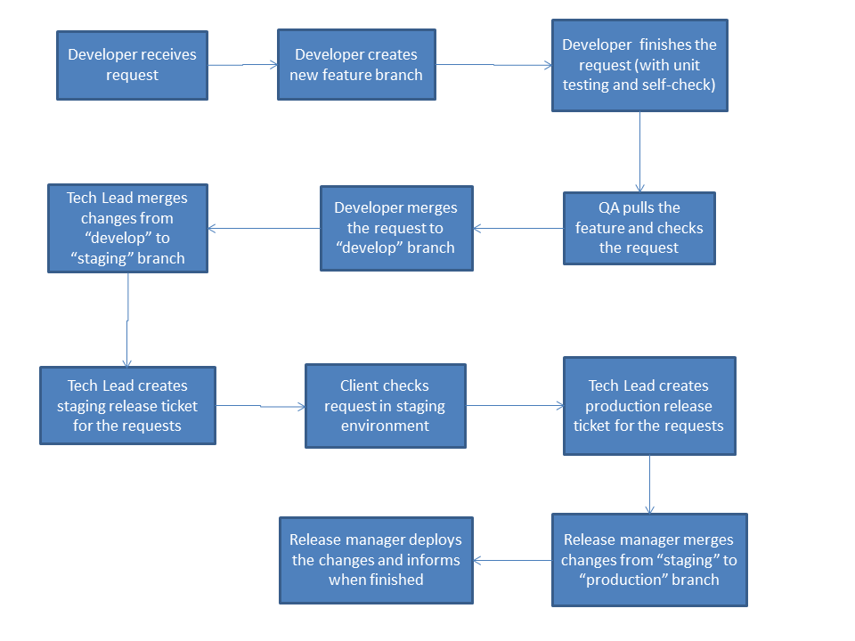

Git Release Process
===================

Intro
-----

The release process will apply to all PH releases (internal tools and front-facing websites). 

Flowchart
---------

Process Explanation
-------------------

Development
~~~~~~~~~~~

This process will mostly involve the **develop** and **feature** branches. 

1. The process starts when the developers receive the request via redmine. The first step that needs to be done is to create a new feature branch for that request. This can be done using either tortoisegit or sourcetree (or by using git commands).

#. The developer needs to checkout(switch to) that branch and work on that issue until everything is completed (including the unit tests). 

#. In order to be able to perform code review on that feature, the developer needs to push it to the **origin** (JP Gitlab) repository. The code will then be available for viewing inside *Redmine Blue*. 

#. Upon completion of the code review and the application of code changes, if there is any, the issue will now enter the testing stage.

Features are named thusly:

.. note::
	- feature/grmXXX* - green redmine requests
	- feature/rmXXX* - blue redmine requests
	- feature/jprmXXX* - JP redmine requests
	- feature/asYYmmddX** - Chatter asana requests

		* *XXX stands for the redmine number.
		* **YYmmdd is the current date, X is [a-z] depending on the sequence of the request for that day.

QA Testing
~~~~~~~~~~

The QA will first need to pull the feature branch that the developer created. The QA will perform all the necessary tests on that branch. Both the developer and the QA will work exclusively on this branch until all the errors or concerns are resolved. Upon completion, the developer will merge the feature branch to the **develop** branch and push it to **origin**. 

Client Testing
~~~~~~~~~~~~~~

All features that needs to be released will be merged to the **staging** branch. This process involves issuing the *merge* command to facilitate the merging of changes from the **develop** branch to the **staging** branch. This merging will be handled by the tech leads of each respective project. 

After merging, the tech leads will file a request for staging release. The client may now start testing the changes in the staging environment.

Production Release
~~~~~~~~~~~~~~~~~~

The tech leads will need to file a ticket for the issues that will be released to the production environment. All the issues in staging that have no request ticket (i.e. requests that failed to meet deadline or postponed issues) will be reverted in both the **staging** and **develop** branches. The remaining changes will then be merged to the **master** and then released to production. The reverting of branches and the capistrano release will be performed by the release manager. 

After the completion of the release, the developer needs to delete the feature branches of the issues that are included in the present release.