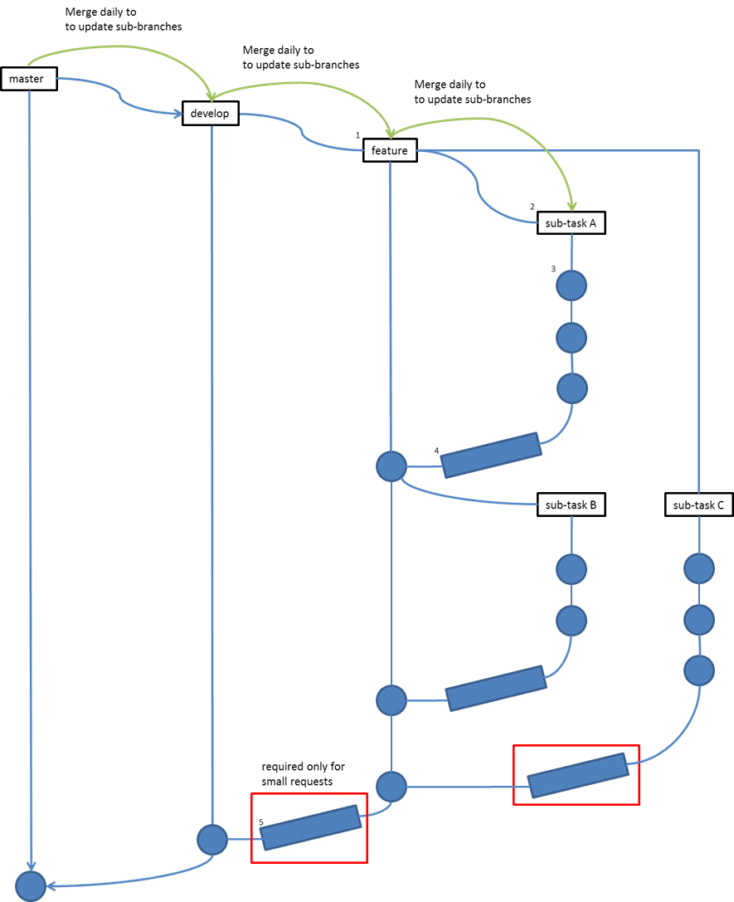

Merge Request
=============

This segment introduces the role of merge requests in the development process. This shows how the codes flow from one branch to another and how they end up in the production. Merge requests allows for the codes to be reviewed first before being merged to the parent branch to ensure 

Main Flow of Merge requests
---------------------------

The main idea is simply described by the following steps:

1. Create feature branch for feature to be implemented.
#. Create subtask branch (if needed).
#. Implement changes on the feature / subtask branch.
#. Merge request from subtask to feature branch (if applicable).
#. Merge request from feature branch to develop (for small requests).

This is further refined for small and bigger requests. Below is the visual flow of a request's branch life cycle in both small and large requests.

.. note::
    - Notice that merge requests from feature to develop is only strictly observed for small requests since these requests won't have any subtasks.

Small Requests (Refined Steps)
------------------------------

For small requests, follow these steps:

1. ``[ Tech Lead ]`` Create main BRM Ticket 
#. ``[ Developer ]`` Create feature Git branch via SourceTree 
#. ``[ Developer ]`` Implement feature    
#. ``[ Developer ]`` Commit and push changes to feature Git branch    
#. ``[ Developer ]`` MERGE REQUEST (feature -> develop)   
    - Merge Request is created? Proceed to 6.
    - Merge Request not yet created? Create via GitLab.
#. ``[ Tech Lead ]`` CODE REVIEW (via GitLab)  
#. ``[ Developer ]`` Code Revision    
    - Are there revisions from code review? Return to 3.
    - There are no revisions? Proceed to 8.
#. ``[ Tech Lead ]`` Accept Merge Request. 

Larger Requests (Refined Steps)
-------------------------------

For larger requests (requests that will have subtasks), follow these steps: 

1. ``[ Tech Lead ]`` Create main BRM ticket.
#. ``[ Developer ]`` Create subtask tickets.
#. ``[ Developer ]`` Check subtasks to be accomplished.
    - There are subtasks to be accomplished? Proceed to 4. 
    - There are no more subtask? Proceed to 11.
#. ``[ Developer ]`` Create subtask Git branch.
#. ``[ Developer ]`` Implement subtask    
#. ``[ Developer ]`` Commit and push changes to subtask Git branch    
#. ``[ Developer ]`` MERGE REQUEST (subtask -> feature)   
    - Merge request is created? Proceed to 8 .
    - Merge Request not yet created? Create via GitLab.
#. ``[ Tech Lead ]`` CODE REVIEW (via GitLab)  
#. ``[ Developer ]`` Code Revision    
    - Are there revisions from code review? Return to 5.
    - There are no revisions? Proceed to 10.
#. ``[ Tech Lead ]`` Accept Merge Request. Proceed to 3.  
#. ``[ Tech Lead ]`` Manual Merge (feature -> develop)

Naming Convention
-----------------

************
Blue Redmine
************

Counterpart feature redmine branch should be created once the Green Redmine task is assigned to a developer. The request issue should follow the details below.

For feature Blue Redmine issues, the following details should be considered:

- **Title**: GRMXXX *<Title of Green Redmine Issue>*
- **Description**: Link to the Green Redmine Issue
- **Tracker**: Request

See the sample below::

  Title: GRM467 Adding Tawk.to in all application-related pages
  Description: http://sample.redmine.com/issues/467
  Tracker: Request

For subtask Blue Redmine issues, the following details should be filled out:

- **Title**: GRMXXX *<Task to be done>*
- **Description**: Brief description of task to be done on subtask
- **Tracker**: Task
- **Parent Task**: Feature Blue Redmine parent issue

See the sample below (Assuming feature issue number created above is 1234)::

  Sample Subtask #1
  Title: GRM467 Add Tawk.to to Landing Pages
  Description: Add Tawk.to widget to all pre-login pages of the website.
  Tracker: Task
  Parent Task: 1234

  Sample Subtask #2
  Title: GRM467 Add Tawk.to to Applicant Pages
  Description: Add Tawk.to to pages that can be seen by applicants.
  Tracker: Task
  Parent Task: 1234

For sample's sake, let's assume that subtasks 1 and 2 have issue numbers 1235 and 1236 respectively.

************
Git Branches
************

Git branches for the request will be formatted consistently with the Blue Redmine Issue equivalent. The following convention should be followed:

- **Feature branch**: rmXXXX
- **Subtask branch**: rmXXXX-XXXX

The first set of *XXXX*'s is the Feature BRM issue number and the succeeding (if applicable) is the Subtask BRM issue number. Taking the examples above, the following will be the git branch names for their request::

  feature/rm1234         <- git branch for feature
  feature/rm1234-1235    <- git branch for subtask #1
  feature/rm1234-1236    <- git branch for subtask #2

*********************
GitLab Merge Requests
*********************

GitLab Merge Requests should also follow a naming convention for requests to be easily identified. Therefore, the following details should be filled out:

- **Title**: GRMXXX *<Title of Green Redmine Issue>*
- **Description**: Changes done on this merge
- **Assign To**: Tech Lead
